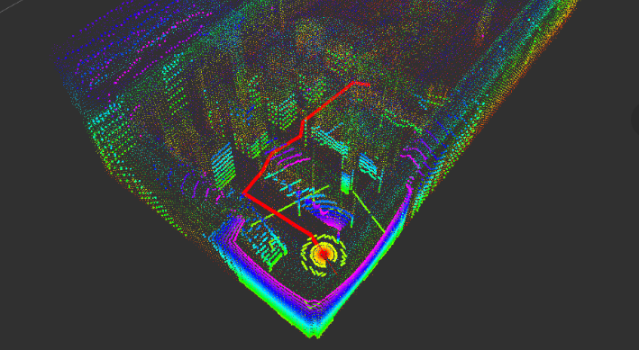

# FastLIO-ROS2-Simulation (ROS 2 + Ignition Gazebo) 🏎️
**Author:** Jossue Espinoza <br>

[](https://docs.ros.org/en/humble/)
[](https://gazebosim.org/home)
[](https://github.com/SteveMacenski/slam_toolbox)
[](https://www.python.org/)
[](LICENSE)

---

This ROS 2 package provides a complete simulation framework for mobile robots in **Ignition Gazebo**.  
It acts as a bridge between simulated environments and [**FAST_LIO**](https://github.com/Ericsii/FAST_LIO_ROS2), enabling seamless integration of **LiDAR**, **IMU**, and **vehicle models**.

Within this repository, you’ll find everything needed to:

- 🛰️ Simulate different **LiDARs**, **vehicles**, and **sensors**.  
- 🔄 **Synchronize IMU and LiDAR** data for accurate mapping.  
- 🗺️ Generate and **save maps** using FAST LIO.  
- 🤖 Add custom **mobile robots** to your simulations.  
- 🧠 Test and evaluate **SLAM algorithms** in virtual environments.

**NOTE:** this repo was tested on Ubuntu 22.04 LTS, with ROS 2 Humble and Gazebo Fortress (Ignition).

--- 
<p align="center">
  
  <br>
  <em>Robot Localization in Real Time with Simulated Lidar</em>
</p>  

> [!IMPORTANT]
> This repository is based on the work of C. Mauricio Arteaga-Escamilla from Robótica Posgrado.
> **Contact email:** cmauricioae8@gmail.com
> **LinkedIn:** https://linkedin.com/in/cruz-mauricio-arteaga-escamilla/
> **YouTube:** https://www.youtube.com/channel/UCNmZp0rCuWxqaKVljny2zyg 


## 📚 Table of Contents
- [Installation](https://github.com/JossueE/FastLIO-ROS2-Simulation?tab=readme-ov-file#installation)
    - [Pre-requisites and Ignition installation](https://github.com/JossueE/FastLIO-ROS2-Simulation?tab=readme-ov-file#pre-requisites-and-ignition-installation)
    - [Cloning FAST_LIO adapted to work with ROS2](https://github.com/JossueE/FastLIO-ROS2-Simulation?tab=readme-ov-file#cloning-fast_lio---mapping-adapted-for-ros-2)
    - [Cloning Localization Requirements](https://github.com/JossueE/FastLIO-ROS2-Simulation?tab=readme-ov-file#cloning-localization-requirements)
    - [Cloning this Repo](https://github.com/JossueE/FastLIO-ROS2-Simulation?tab=readme-ov-file#cloning-this-repo)

- [Configuration](https://github.com/JossueE/FastLIO-ROS2-Simulation?tab=readme-ov-file#configuration)
    - [Configure The Simulation](https://github.com/JossueE/FastLIO-ROS2-Simulation?tab=readme-ov-file#configure-the-simulation)
    - [Adding New Robots and Worlds](https://github.com/JossueE/FastLIO-ROS2-Simulation?tab=readme-ov-file#adding-new-robots-and-worlds)
    - [Configure your LiDAR (URDF/Xacro + Ignition)](https://github.com/JossueE/FastLIO-ROS2-Simulation?tab=readme-ov-file#configure-your-lidar-urdfxacro--ignition)
    - [Configure your IMU (URDF/Xacro + Ignition)](https://github.com/JossueE/FastLIO-ROS2-Simulation?tab=readme-ov-file#configure-your-imu-urdfxacro--ignition)
    - [Configure FAST_LIO](https://github.com/JossueE/FastLIO-ROS2-Simulation?tab=readme-ov-file#configure-fast_lio)
    - [Configure Localization](https://github.com/JossueE/FastLIO-ROS2-Simulation?tab=readme-ov-file#configure-localization)

- [Usage](https://github.com/JossueE/FastLIO-ROS2-Simulation?tab=readme-ov-file#usage)
    - [Mapping](https://github.com/JossueE/FastLIO-ROS2-Simulation?tab=readme-ov-file#mapping)
        - [Launching the Robot in Gazebo](https://github.com/JossueE/FastLIO-ROS2-Simulation?tab=readme-ov-file#launching-the-robot-in-gazebo)
        - [Launching the SLAM (FAST_LIO Mapping)](https://github.com/JossueE/FastLIO-ROS2-Simulation?tab=readme-ov-file#launching-the-slam-fast_lio-mapping)
        - [Teleoperating the Robot](https://github.com/JossueE/FastLIO-ROS2-Simulation?tab=readme-ov-file#teleoperating-the-robot) 
        - [Saving the Map (.pcd)](https://github.com/JossueE/FastLIO-ROS2-Simulation?tab=readme-ov-file#saving-the-map-pcd)
        - [Displaying the Map](https://github.com/JossueE/FastLIO-ROS2-Simulation?tab=readme-ov-file#displaying-the-map)
    - [Localization](https://github.com/JossueE/FastLIO-ROS2-Simulation?tab=readme-ov-file#localization)
        - [Localization in a Previous Map Saved](https://github.com/JossueE/FastLIO-ROS2-Simulation?tab=readme-ov-file#localization-in-a-previous-map-saved)


---

## Installation

> [!IMPORTANT]
> It is necessary to follow **all** the steps defined below, including:
> - Pre-requisites  
> - Ignition installation  
> - Cloning FAST_LIO → Mapping (adapted for ROS 2)  
> - Cloning Localization Requirements (adapted for ROS 2)

### Pre-requisites and Ignition installation

It is assumed that any distro of ROS 2 is already installed.
To avoid possible errors, please update your system and install the following ROS 2 dependencies.

> [!NOTE]
> You don’t need to modify $ROS_DISTRO; it’s a global environment variable.
> If the command doesn’t work, it probably means your ROS 2 installation is incomplete or not properly sourced.

```bash
sudo apt-get update
sudo apt-get install ros-$ROS_DISTRO-joint-state-publisher ros-$ROS_DISTRO-xacro ros-$ROS_DISTRO-joint-state-publisher-gui ros-$ROS_DISTRO-tf2-* ros-$ROS_DISTRO-gazebo-* ros-$ROS_DISTRO-rviz-default-plugins ros-$ROS_DISTRO-ros2-control ros-$ROS_DISTRO-ros2-controllers ros-$ROS_DISTRO-controller-manager ros-$ROS_DISTRO-pcl-*
```

To install Ignition to work with ROS 2, run the following command:

```bash
sudo apt-get install ros-$ROS_DISTRO-ros-gz
```

The ros-gz package from source can be found here 
https://github.com/gazebosim/ros_gz/tree/humble

> [!IMPORTANT]
> Additionally, to be able to communicate our simulation with ROS 2, it is needed to use a package called 'ros_gz_bridge'. This package provides a network bridge which enables the exchange of messages between ROS 2 and Gazebo transport. You can install this package by typing:

```bash
sudo apt-get install ros-$ROS_DISTRO-ros-ign-bridge
```

Finally install libpcl

```bash
sudo apt install libpcl-dev
```

**Note:** _This is made only once for the whole workspace._

---

### Cloning FAST_LIO -> Mapping (adapted for ROS 2) 

> [!IMPORTANT]
> Before cloning the repository, make sure you have FAST_LIO (ROS 2–adapted version) available.

Please refer to the official documentation at  
[FAST_LIO_ROS2](https://github.com/Ericsii/FAST_LIO_ROS2)  
for detailed installation and configuration instructions.

> [!IMPORTANT]  
> **Dependencies are mandatory for this algorithm to work properly.**  
> Make sure the following libraries are installed before building:
> 
> - **PCL ≥ 1.8** — Follow the [PCL Installation Guide](https://pointclouds.org/downloads/#linux)  
> - **Eigen ≥ 3.3.4** — Follow the [Eigen Installation Guide](http://eigen.tuxfamily.org/index.php?title=Main_Page)

This package follows a **plug-and-play architecture**.  
That means you can use the **same package** both in simulation and with your **real-world LiDAR** —  
without modifying or affecting the original source code. 

This package also requires a subpackage called **`livox_ros_driver2`**,  
which is essential when working with **Livox AVIA LiDARs** in real-world applications.

If you **do not plan to use a real LiDAR from Livox**, you can safely **comment out all related dependencies** —  
the package will still compile and run correctly in simulation mode.

Please comment: 
**File:** `~/colcon_ws/src/FAST_LIO_ROS2/CMakeLists.txt`
- **Line 62**
  ```cmake
  #find_package(livox_ros_driver2 REQUIRED)
  ```
- **Line 76**
  ```cmake
  set(dependencies
    rclcpp
    rclcpp_components
    geometry_msgs
    nav_msgs
    sensor_msgs
    std_msgs
    std_srvs
    visualization_msgs
    pcl_ros
    pcl_conversions
    #livox_ros_driver2
    )
  ```
**File:** `~/colcon_ws/src/FAST_LIO_ROS2/package.xml`
- **Line 30**
  ```xml
    <!-- <depend>livox_ros_driver2</depend> -->
  ```

However, if it’s not a problem for your setup, it’s recommended to **keep the original configuration**  
so that the system remains fully compatible with both **simulation** and **real-world** LiDAR setups.

### Cloning Localization Requirements

This package includes its own ROS 2–adapted version of
[lidar_localization_ros2](https://github.com/rsasaki0109/lidar_localization_ros2?tab=readme-ov-file#lidar_localization_ros2),
so you only need to download the following dependency:

- [ndt_omp_ros2](https://github.com/rsasaki0109/ndt_omp_ros2.git)

```bash
cd ~/colcon_ws/src
git clone https://github.com/rsasaki0109/ndt_omp_ros2.git
cd ..
```

### Cloning this Repo

Clone this package inside the `src` directory of your ROS 2 workspace.  
Replace **`colcon_ws`** with the name of your own workspace folder.

```bash
cd ~/colcon_ws/src
git clone https://github.com/JossueE/FastLIO-ROS2-Simulation.git
cd ..
```
First, build the required external package:

```bash
colcon build --packages-select ndt_omp_ros2
source install/setup.bash
```
Then, build colcon ws:

```bash
colcon build --packages-select slam_sim --symlink-install
source install/setup.bash
```

> [!NOTE]
> This builds the package and sets a symbolic link to the python files (nodes and launch files). With this, re-build every time that a python file is modified, is not required.<br>

If some warnings appear, run `colcon build --packages-select slam_sim --symlink-install` again and they will disappear.

---
## Configuration

### Configure The Simulation

The `one_robot_ign_launch.py` file launches **Gazebo (Ignition)** using a predefined world and spawns the selected robot model automatically.

Inside the repository, you’ll find a configuration file located at `config/config.yaml`.  
This file contains adjustable parameters for the simulation, as well as configuration options for the LiDAR and IMU functionalities.

> [!IMPORTANT]
> To use the map `world_file` named **depot.sdf**, located in `colcon_ws/src/slam_sim/worlds`,  
> you must first extract the **Depot.zip** file found in `colcon_ws/src/slam_sim`.  
> After extracting it, copy the resulting folder into your `~/.ignition/models` directory.

### Adding New Robots and Worlds

You can easily **add a new robot model** by creating a **URDF** description in  
`slam_sim/urdf/`, preferably in **`.xacro`** format for easier parameterization and reuse.

To include a new environment, simply **add your world file** in  
`slam_sim/worlds/` using the **`.sdf`** format.

Once added, you can select them in the launch file by updating:
```python
robot_model = '<your_robot_name>'
world_file = '<your_world_name>.sdf'
```
> [!IMPORTANT]
> To obtain a correct behavior of the sensors, the world.sdf file MUST be correctly set by adding the corresponding 'plugin' tag inside the 'world' tag. For more information. please refer to https://gazebosim.org/docs/latest/sensors/.

### Configure your LiDAR (URDF/Xacro + Ignition)

This repo mounts a LiDAR on `base_link` and spawns an Ignition (Gazebo) ray sensor.  
You can tune **pose**, **FOV**, **resolution**, **rate**, **range** and the **topic** directly in the `config/config.yaml` file.

> [!TIP]
> Use **`gpu_lidar`** if you have GPU available (faster). Use **`lidar`** for CPU-only.
> Also, can add or modify the noise directly in your .xacro file.

```yaml
    lidar:
    lidar_frequency: 10.0              # Lidar frequency in Hz (typical value: 10 Hz)
    period: 0.1                        # Scanning period in seconds
    lidar_out_topic: '/lidar/points'   # Output topic for published point clouds

    horizontal_samples: 360            # Number of horizontal scan samples per rotation
    horizontal_resolution: 1           # Horizontal angular resolution in degrees
    horizontal_min_angle: -3.14159     # Minimum horizontal angle (radians)
    horizontal_max_angle:  3.14159     # Maximum horizontal angle (radians)

    vertical_samples: 32               # Number of vertical scan lines
    vertical_resolution: 1             # Vertical angular resolution in degrees
    vertical_min_angle: -0.78539       # Minimum vertical angle (-45°)
    vertical_max_angle:  0.78539       # Maximum vertical angle (+45°)

    min_distance: 0.2                  # Minimum measurable distance (meters)
    max_distance: 100.0                # Maximum measurable distance (meters)
    resolution: 0.017453               # Angular resolution in radians (~1°)
```

In this repository, a general LiDAR configuration example is provided.  
If you want to adapt it to a specific sensor, here are some key parameters to tune:

- **`lidar_frequency`** — Default is `10 Hz`, since most LiDARs operate around this range. Adjust it according to your sensor specifications.  
- **`horizontal_*` and `vertical_*` parameters** — Define the LiDAR’s scanning structure:
  - `samples` → number of beams or steps per axis  
  - `resolution` → angular precision (° or radians)  
  - `min_angle` / `max_angle` → scanning limits for each axis  
- **`min_distance`, `max_distance`, and `resolution`** — Define the LiDAR’s detection range and precision.  
  Ensure these match your hardware’s datasheet for accurate simulation results.


### Configure your IMU (URDF/Xacro + Ignition)

In this repository you’ll find a simulated IMU with a configurable update rate.  
By default, a small amount of noise is enabled to approximate real-world behavior.  
If you want to customize noise, edit your robot’s `.xacro` to pass the values below to the IMU plugin.

```yaml
imu:
    imu_frequency : 50.0 # The frequency of the lidar in Hz
    imu_out_topic: '/imu' #The output topic of the IMU
```

### Configure FAST_LIO
FAST_LIO supports multiple LiDAR families (Velodyne, Livox/Avia, Ouster, Unitree, etc.).
Create a sensor-specific config file in `fast_lio/config/`, e.g. `simulated.yaml`, and reference it from your launch.

> [!IMPORTANT]
> Wherever you see comments like `# <----------------- HERE ... ----------------->`, copy the **exact values** you already defined in your repo’s config:
> - `common.lid_topic` ← your `lidar_out_topic`
> - `common.imu_topic` ← your `imu_out_topic`
> - `preprocess.scan_line` ← your `vertical_samples`
> - `preprocess.scan_rate` ← your `lidar_frequency` LiDAR rotation rate in Hz (e.g., 10)
> - `mapping.fov_degree` ← `horizontal_max_angle` and `horizontal_min_angle` (in degrees)
> - `mapping.det_range` ← your `max_distance`

```yaml
/**:
    ros__parameters:
        feature_extract_enable: false
        point_filter_num: 4
        max_iteration: 3
        filter_size_surf: 0.2
        filter_size_map: 0.2
        cube_side_length: 1000.0
        runtime_pos_log_enable: true
        map_file_path: PCD/name_of_your_map.pcd # <----------------- HERE YOU DEFINE YOUR OUTPUT FILE ----------------->

        common:
            lid_topic:  "/lidar/points"  # <----------------- HERE YOU PUT EXACTLY THE lidar_out_topic DEFINED BEFORE ----------------->
            imu_topic:  "/imu"      # <----------------- HERE YOU PUT EXACTLY THE imu_out_topic DEFINED BEFORE ----------------->
            time_sync_en: false         # ONLY turn on when external time synchronization is really not possible
            time_offset_lidar_to_imu: 0.0 # Time offset between lidar and IMU calibrated by other algorithms, e.g. LI-Init (can be found in README).
                                        # This param will take effect no matter what time_sync_en is. So if the time offset is not known exactly, please set as 0.0

        preprocess:
            lidar_type: 5                # 1 for Livox serials LiDAR, 2 for Velodyne LiDAR, 3 for ouster LiDAR, 5 simulated <----- DO NOT MODIFY
            scan_line: 32                # <----------------- HERE YOU PUT EXACTLY THE vertical_samples DEFINED BEFORE ----------------->
            scan_rate: 10                # <----------------- HERE YOU PUT EXACTLY THE lidar_frequency DEFINED BEFORE ----------------->
            timestamp_unit: 0            # the unit of time/t field in the PointCloud2: 0-second, 1-milisecond, 2-microsecond, 3-nanosecond. <----- DO NOT MODIFY
            blind: 0.05

        mapping:
            acc_cov: 0.1
            gyr_cov: 0.1
            b_acc_cov: 0.0001
            b_gyr_cov: 0.0001
            fov_degree:    360.0          # <----------------- HERE YOU PUT EXACTLY THE horizontal_samples DEFINED BEFORE ----------------->       
            det_range:     100.0          # <----------------- HERE YOU PUT EXACTLY THE max_distance DEFINED BEFORE ----------------->
            extrinsic_est_en:  false      # true: enable the online estimation of IMU-LiDAR extrinsic,

            extrinsic_T: [-0.04, 0., 0.07] # <----------------- CHECK the note IMPORTANT BELOW 
            extrinsic_R: [ 1., 0., 0., 
                           0., 1., 0., 
                           0., 0., 1.]

        publish:
            map_pub_en: true 
            path_en:  false
            scan_publish_en:  true       # false: close all the point cloud output
            dense_publish_en: true       # false: low down the points number in a global-frame point clouds scan.
            scan_bodyframe_pub_en: true  # true: output the point cloud scans in IMU-body-frame

        pcd_save:
            pcd_save_en: true
            interval: -1                 # how many LiDAR frames saved in each pcd file; 
                                        # -1 : all frames will be saved in ONE pcd file, may lead to memory crash when having too much frames.
```


> [!WARNING]
> Make sure that:
> - In your URDF/Xacro, the LiDAR pose relative to the IMU/base_link matches
> - In FAST_LIO, `mapping.extrinsic_T` and `mapping.extrinsic_R` are set to that same transform
> 
> Once the extrinsics are correct, you should see stable logs like:
> `In num: 11520 downsamp ≈ 2400 ... effect num ≈ 1200`
> and no more `No point, skip this scan!`.
> 
> The values you see in my `extrinsic_T` come from the fact that my IMU is located at the origin of `base_link` (0, 0, 0).
> Therefore, `extrinsic_T` directly matches the `lidar_joint` origin offset.
> In your case, these values **must** be configured according to the relative pose between your IMU (body frame) and your LiDAR in your own robot model.


Then go to `fast_lio/launch/mapping.launch.py` and modify this function:

```python
decalre_config_file_cmd = DeclareLaunchArgument(
    'config_file', default_value='simulated.yaml', # <----------------- HERE YOU PUT EXACTLY THE Same that you put in your .yaml DEFINED BEFORE ----------------->
    description='Config file'
)
```
> [!NOTE]
> This step is optional — you can also specify the `config_file` directly in the launch command (see the **Launch** section below).
---

### Configure Localization

Some parameters (such as **frequency**, **max_distance**, etc.) are inherited from previous sections of the configuration file.  
In this block, you can fine-tune how the **localization node** behaves, including:

- The registration algorithm used for pose estimation.
- The precision and robustness of NDT-based matching.
- Whether to use a precomputed PCD map or not.
- The initial pose of the robot in the map frame.
- The reference frames used for TF (`map`, `odom`, `base_link`).
- The use of additional sensors such as odometry and IMU.

Below is an example of the `localization` configuration section:

```yaml
localization:
    registration_method: "NDT_OMP"   # Registration method used for scan matching
    score_threshold: 2.0             # Threshold to accept/reject a registration result
    ndt_resolution: 1.0              # NDT grid resolution [m]
    ndt_step_size: 0.1               # Step size for the optimizer
    ndt_num_threads: 4               # Number of threads used by NDT_OMP
    transform_epsilon: 0.01          # Convergence criteria for the transformation
    voxel_leaf_size: 0.2             # Leaf size for downsampling the input cloud
    use_pcd_map: true                # Use a prebuilt PCD map for localization
    set_initial_pose: true           # Whether to set an explicit initial pose
    initial_pose_x: 0.0              # Initial pose (x) in map frame
    initial_pose_y: 0.0              # Initial pose (y) in map frame
    initial_pose_z: 0.0              # Initial pose (z) in map frame
    initial_pose_qx: 0.0             # Initial orientation (qx) in map frame
    initial_pose_qy: 0.0             # Initial orientation (qy) in map frame
    initial_pose_qz: 0.0             # Initial orientation (qz) in map frame
    initial_pose_qw: 0.0             # Initial orientation (qw) in map frame
    use_odom: false                  # Enable fusion with wheel odometry
    use_imu: false                   # Enable fusion with IMU data
    enable_debug: true               # Publish extra debug information / topics
    global_frame_id: map             # Global reference frame
    odom_frame_id: odom              # Odometry frame
    base_frame_id: base_link         # Robot base frame

```

## Usage
> [!IMPORTANT]
> The following sections are intended to be used as a **step-by-step usage guide**, from zero to a complete workflow.
> You can follow them in order, or jump directly to the part you need once you are familiar with the setup.
>
> We work with **two main workflows**:
> - **Mapping**  
>   You will:
>   1. **Launch the robot in Gazebo**  
>   2. **Launch FAST_LIO (Mapping)** to build a LiDAR map (.pcd)  
>   3. **Teleoperate the robot** around the environment  
>   4. **Save the map (.pcd)**  
>   5. (Optional) **Display the final map**
>
> - **Localization**  
>   You will:
>   1. **Launch the robot in Gazebo**  
>   2. **Load the previously saved map** and start the localization node  
>   3. **Teleoperate the robot** again, now using the existing map for localization

### Mapping
#### Launching the Robot in Gazebo

You can start the simulation with:

```bash
cd ~/colcon_ws
colcon build --packages-select ndt_omp_ros2
source install/setup.bash
```
Then:
```bash
colcon build --packages-select slam_sim --symlink-install
source install/setup.bash
ros2 launch slam_sim one_robot_ign_launch.py
```
> [!NOTE]
> - The first launch may take longer while Gazebo/Ignition caches assets and loads world resources.
> - If you change the **LiDAR** or **IMU** topic names, update your RViz displays (reselect topics) so they match the new names.


#### Launching the SLAM (FAST_LIO Mapping)

In a new terminal and with the steps before completed.

```bash
cd ~/colcon_ws
source install/setup.bash
ros2 launch fast_lio mapping.launch.py  # <-------- This correspond from an external package
```
Or whit the config_file as an argument:
```bash
ros2 launch fast_lio mapping.launch.py config_file:=simulated.yaml
```
RViz will open with the LiDAR map view. Any warnings or errors will appear in the terminal.

> [!NOTE]
> To see more information check de original documentation. [Link](https://github.com/Ericsii/FAST_LIO_ROS2)

---

#### Teleoperating the Robot

To teleoperate both the **_differential_** and **_omnidirectional_** mobile robot, use the package node:

```bash
ros2 run slam_sim omni_teleop_keyboard.py
```

To publish a velocity from terminal:

```bash
ros2 topic pub --once /cmd_vel geometry_msgs/msg/Twist "{linear: {x: 0.1, y: 0.1}, angular: {z: 0.3}}"
```
To publish a velocity directly on a **Ignition** Topic from terminal:

```bash
ign topic -t "/model/r1/cmd_vel" -m ignition.msgs.Twist -p "linear: {x: 0.5, y: 0.5}"
```
---

#### Saving the Map (.pcd)

Move the robot to cover the environment and avoid losing measurements.
When you’re satisfied with the coverage, call the service to save the map (FAST_LIO saves PCD files):

 - Enable the map-save flag `pcd_save.pcd_save_en`, `publish.map_pub_en` and set the output `map_file_path` in `fast_lio/config/simulated.yaml` (e.g., map_file_path: `PCD/name_of_your_map.pcd` and ).  
 - With **Launching the SLAM (FAST_LIO Mapping)** active
 - Open RQt and switch to `Plugins->Services->Service Caller`. Trigger the service `/map_save`, then the pcd map file will be generated

or in a new terminal: 
```bash
ros2 service call /map_save std_srvs/srv/Trigger "{}" 
```
> [!WARNING]
> If you see logs with:
> `No point, skip this scan!` and very low `downsamp` values (e.g. `downsamp 1`)
> check your IMU–LiDAR extrinsics.

#### Displaying the Map

Once your map has been saved, you can visualize the final result with:

> [!IMPORTANT]
> Make sure the path in `config/config.yaml` matches exactly the location where your map was saved.
> Be careful when mixing relative and absolute paths.

```bash
ros2 launch slam_sim display_map_launch.py
```
### Localization 
#### Localization in a Previous Map Saved

First you have to run the [**Launching the Robot in Gazebo**](https://github.com/JossueE/FastLIO-ROS2-Simulation?tab=readme-ov-file#launching-the-robot-in-gazebo) exactly as we defined in the previous section Mapping. 

> [!NOTE]
> Once the simulation is running, you can close the default RViz2 window that starts with the launcher if you prefer to use a custom RViz2 configuration.

Start RViz2 with the Localization Configuration

In a new terminal:
```bash
cd ~/colcon_ws
source install/setup.bash
rviz2 -d src/slam_sim/rviz/localization.rviz
```
Launch the Localization Node
In another terminal:
```bash
cd ~/colcon_ws
source install/setup.bash
ros2 launch slam_sim lidar_localization_launch.py
```

Finally, you can teleoperate the robot using the same teleop node described earlier in [**Teleoperating the Robot**](https://github.com/JossueE/FastLIO-ROS2-Simulation?tab=readme-ov-file#teleoperating-the-robot) defined before. 